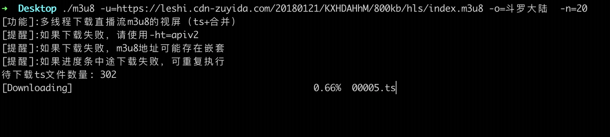

# m3u8-downloader

golang Multi-threaded download of live streaming m3u8 format video screens, cross-platform. You just need to specify the necessary flags (`u`, `o`, `n`, `ht`) to run, and the tool will automatically parse the M3U8 file for you and download the TS clips and merge them into one file.


## Function

1. Download and parse M3U8
2. Download TS Failure Retry (Simultaneous decryption of encryption)
3. Combining TS clips


## Effective demonstration


## Parameter Description:

```
- u m3u8 download address (http(s)://url/xx/xx/index.m3u8)
- o movieName: customized file name (default is movie) without suffix (default “movie”)
- n num:number of download threads(default 24)
- ht hostType:set the way to getHost (v1: http(s):// + url.Host + filepath.Dir(url.Path); v2: `http(s)://+ u.Host` (default “v1”))
- c cookie:custom request cookie (e.g. key1=v1; key2=v2)
- r autoClear: if or not to automatically clear the ts file (default true)
- s InsecureSkipVerify:whether to allow insecure requests (default 0)
- sp savePath:absolute path to save the file (default is current path, default is recommended) (e.g.: unix:/Users/xxxx ; windows:C:\Documents)
```

By default, you only need to pass the `u` parameter, and leave the other parameters as default. Some links may limit the frequency of requests, so you can adjust the value of the `n` parameter accordingly.


## usage

### Source Code Approach

```bash
自己编译：go build -o m3u8-downloader
简洁使用：./m3u8-downloader  -u=http://example.com/index.m3u8
完整使用：./m3u8-downloader  -u=http://example.com/index.m3u8 -o=example -n=16 -ht=v1 -c="key1=v1; key2=v2"
```

### Binary mode:

Linux/ MacOS/ Windows PowerShell

```
Simple to use:
./m3u8-linux-amd64 -u=http://example.com/index.m3u8
./m3u8-darwin-amd64 -u=http://example.com/index.m3u8 
.\m3u8-windows-amd64.exe -u=http://example.com/index.m3u8

Complete use:
./m3u8-linux-amd64 -u=http://example.com/index.m3u8 -o=example -n=16 -ht=v1 -c="key1=v1; key2=v2"
./m3u8-darwin-amd64 -u=http://example.com/index.m3u8 -o=example -n=16 -ht=v1 -c="key1=v1; key2=v2"
.\m3u8-windows-amd64.exe -u=http://example.com/index.m3u8 -o=example -n=16 -ht=v1 -c="key1=v1; key2=v2"
```

## Description of the problem

1. On Linux or mac platforms, if you see no run permissions, use the chmod command to add permissions.
```bash
 # Linux amd64 platform
 chmod 0755 m3u8-linux-amd64
 # Mac darwin amd64 platform
 chmod 0755 m3u8-darwin-amd64
 ```
2.In case of download failure, please set -ht=“v1” or -ht=“v2” (default is v1).
```golang
func get_host(Url string, ht string) string {
    u, err := url.Parse(Url)
    var host string
    checkErr(err)
    switch ht {
    case "v1":
        host = u.Scheme + "://" + u.Host + path.Dir(u.Path)
    case "v2":
        host = u.Scheme + "://" + u.Host
    }
    return host
}
```
